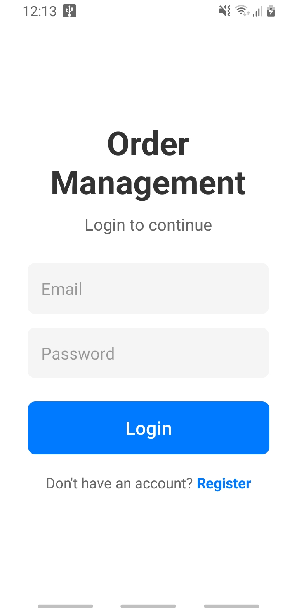
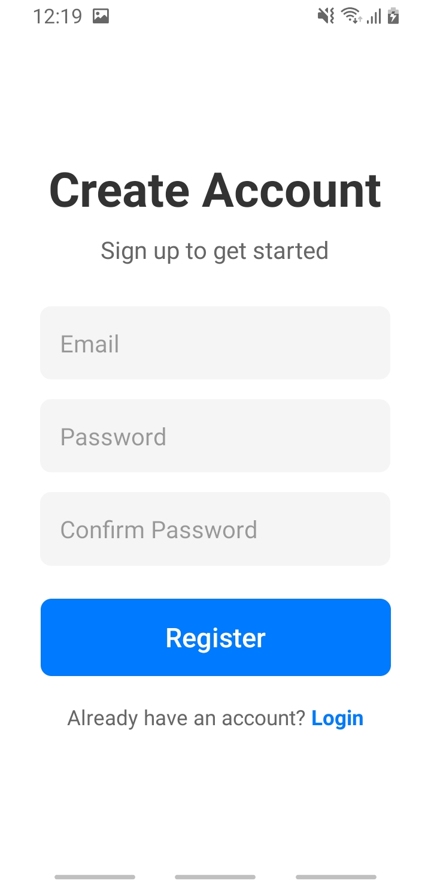
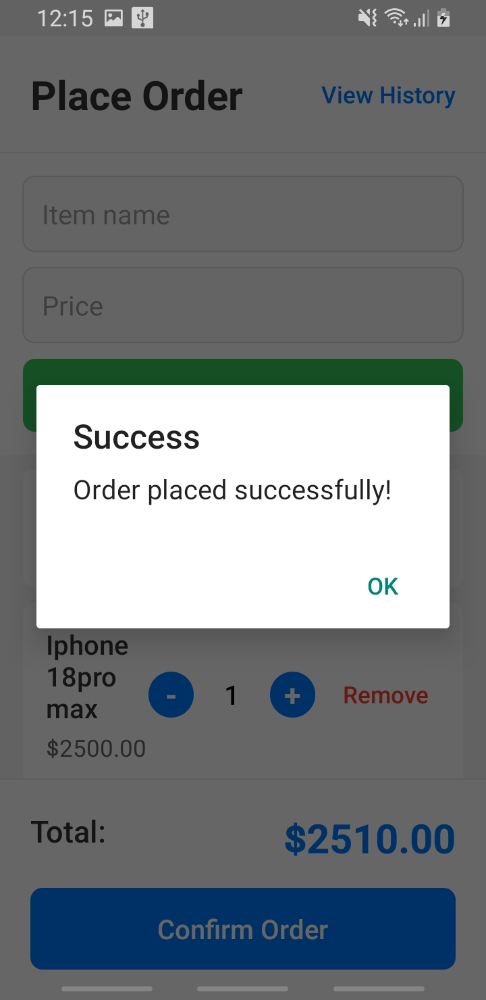
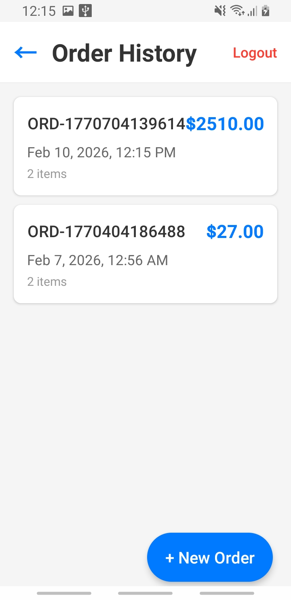
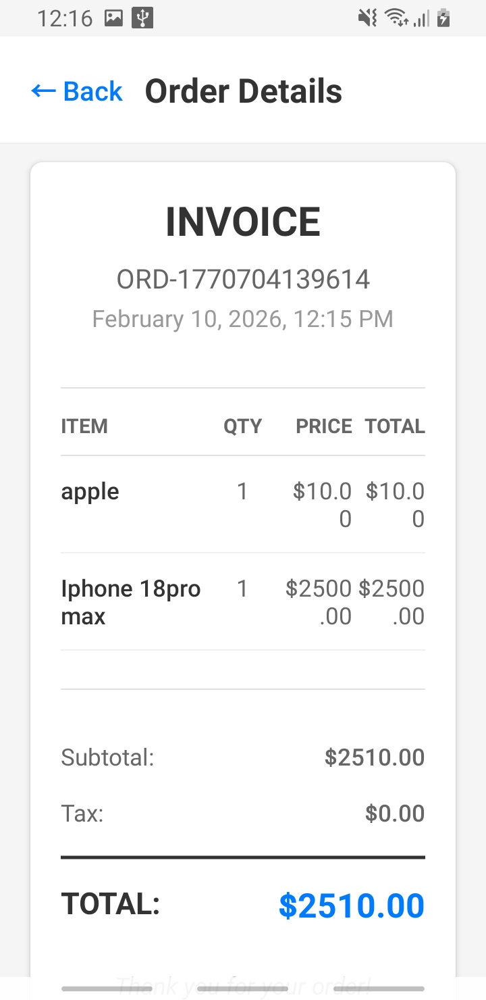

# OrderApp - React Native Order Management System

A React Native application built with Expo for managing orders with Firebase integration, featuring authentication, order history, invoice-style summaries, and reorder functionality.

## 🚀 Features

- ✅ Firebase Firestore for order storage
- ✅ Firebase Authentication (Email/Password)
- ✅ Order creation with cart management
- ✅ Order history linked to user profile
- ✅ Invoice-style order summaries
- ✅ Reorder functionality
- ✅ Real-time order updates
- ✅ Responsive UI with proper error handling

## 📸 Screenshots

| Login | Register | Place Order |
|-------|----------|-------------|
|  |  |  |

| Order History | Invoice View |
|---------------|--------------|
|  |  |

## 📋 Prerequisites

- Node.js (v14 or higher)
- npm or yarn
- Expo CLI (`npm install -g expo-cli`)
- EAS CLI for building (`npm install -g eas-cli`)
- Android Studio (for Android emulator) or physical Android device
- Firebase project with Firestore and Authentication enabled

## 🛠️ Setup Instructions

### 1. Clone and Install Dependencies

```bash
cd OrderApp
npm install
```

### 2. Firebase Configuration

The Firebase configuration is already set up in `src/firebase/firebaseConfig.ts` with the provided credentials.

**Important**: Ensure your Firebase project has:
- **Authentication** enabled (Email/Password provider)
- **Firestore Database** created with the following rules:

```javascript
rules_version = '2';
service cloud.firestore {
  match /databases/{database}/documents {
    match /orders/{orderId} {
      allow read, write: if request.auth != null && request.auth.uid == resource.data.userId;
      allow create: if request.auth != null && request.auth.uid == request.resource.data.userId;
    }
  }
}
```

### 3. Run the App

```bash
# Start the development server
npm start

# Run on Android
npm run android

# Run on iOS (Mac only)
npm run ios
```

## 📁 Project Structure

```
OrderApp/
├── src/
│   ├── screens/
│   │   ├── LoginScreen.tsx          # User authentication
│   │   ├── RegisterScreen.tsx       # New user registration
│   │   ├── PlaceOrderScreen.tsx     # Create new orders
│   │   ├── OrderHistoryScreen.tsx   # View past orders
│   │   └── OrderDetailsScreen.tsx   # Invoice view & reorder
│   ├── components/
│   │   ├── OrderItem.tsx            # Order list item
│   │   └── InvoiceCard.tsx          # Invoice-style display
│   ├── firebase/
│   │   └── firebaseConfig.ts        # Firebase initialization
│   ├── context/
│   │   └── AuthContext.tsx          # Authentication state
│   ├── utils/
│   │   └── formatPrice.ts           # Price formatting utility
│   └── types/
│       └── index.ts                 # TypeScript definitions
├── App.tsx                          # Main app component
├── app.json                         # Expo configuration
└── eas.json                         # EAS Build configuration
```

## 🔄 Order Flow Logic

### 1. Place Order
- User adds items to cart with name and price
- Can adjust quantities or remove items
- Total is calculated automatically
- Order is saved to Firestore upon confirmation
- Order is linked to authenticated user's UID

### 2. Order History
- Fetches all orders for the logged-in user
- Real-time updates via Firestore listener
- Orders sorted by creation date (newest first)
- Empty state shown when no orders exist

### 3. Order Details
- Displays invoice-style summary
- Shows itemized breakdown with quantities and prices
- Includes subtotal and grand total

### 4. Reorder Implementation
- Copies items from previous order
- Navigates to PlaceOrderScreen with pre-populated items
- User can modify items before confirming
- **Does NOT duplicate the Firebase order record**
- Creates a new order only when user confirms

## 🐛 Bug Fixes Implemented

### Bug Fix #1: Reorder Items Handling
**Location**: `PlaceOrderScreen.tsx`  
**Issue**: Reorder items from route params weren't being loaded  
**Fix**: Added useEffect to handle route params on component mount

### Bug Fix #2: Total Calculation
**Location**: `PlaceOrderScreen.tsx` - `calculateTotal()`  
**Issue**: Total wasn't accounting for item quantities  
**Fix**: Changed calculation to `price × quantity` for each item

### Bug Fix #3: FlatList Keys
**Location**: `PlaceOrderScreen.tsx`  
**Issue**: Missing proper key extraction for FlatList items  
**Fix**: Added `keyExtractor={(item) => item.id}`

### Bug Fix #4: Firestore Listener Cleanup
**Location**: `OrderHistoryScreen.tsx`  
**Issue**: Memory leak from unclosed Firestore listener  
**Fix**: Return unsubscribe function in useEffect cleanup

### Bug Fix #5: Date Formatting
**Location**: `OrderHistoryScreen.tsx`  
**Issue**: Firestore timestamps weren't properly converted to Date objects  
**Fix**: Use `.toDate()` method on Firestore timestamps

## 📱 Build & Deployment

### Generate APK (for testing)

```bash
# Install EAS CLI
npm install -g eas-cli

# Login to Expo account
eas login

# Configure EAS Build
eas build:configure

# Build APK
eas build --platform android --profile preview
```

### Generate AAB (for Play Store)

```bash
# Build production AAB
eas build --platform android --profile production
```

### Download Build
After build completes, download the APK/AAB from the Expo dashboard or the provided link.

## 🧪 Testing Results

### Development Testing
- Tested on: Expo Go during development
- Features verified: Authentication, order creation, history, reorder

### Real Device Testing
**Instructions**:
1. Build APK using EAS Build preview profile
2. Download APK to Android device
3. Install via USB or download link
4. Test the following:
   - User registration and login
   - Order creation with multiple items
   - Order history loading
   - Order details display
   - Reorder functionality
   - App performance and responsiveness

**Expected Results**:
- App loads within 2-3 seconds
- Orders save successfully to Firestore
- Order history loads within 1-2 seconds
- No crashes or UI rendering issues
- Smooth navigation between screens

## 📦 Play Store Deployment Checklist

See `DEPLOYMENT_CHECKLIST.md` for complete deployment guide.

## 🔒 Security Notes

- Firebase credentials are included for demonstration purposes
- In production, use environment variables for sensitive data
- Update Firestore security rules for production use
- Implement proper input validation and sanitization

## 📄 License

This project was created as an educational assignment.

## 🤝 Support

For issues or questions, please refer to the documentation or contact the developer.
#

